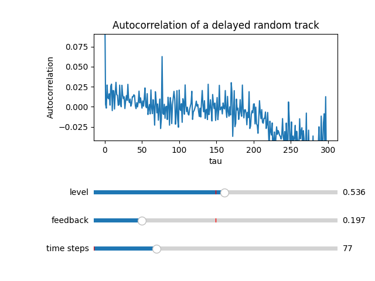
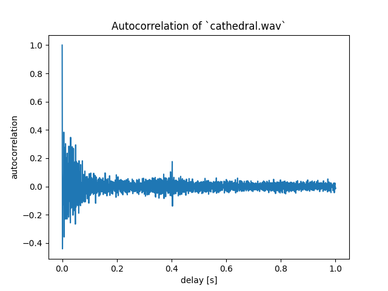
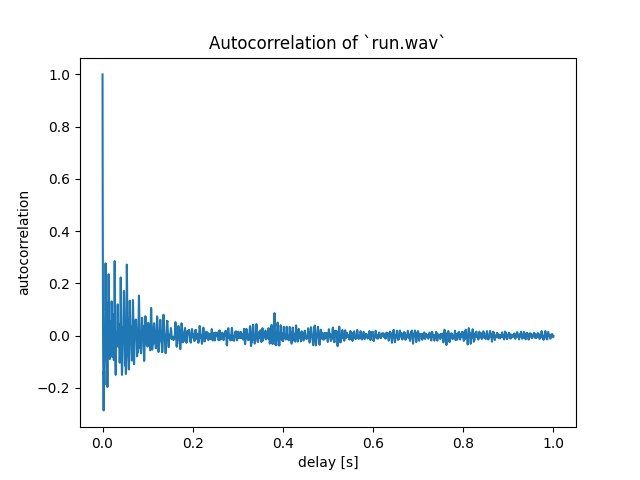

# Cathedral

## Introduction
This project started from the Eddie Van Halen song "Cathedral". It features a delayed guitar track and my objective is to retrieve the delay settings using scientific computing.

If you take a signal and apply a delay, the resulting signal will be correlated with the original one because there are repeating parts. If you compute the correlation between the delayed track and a translated version (operation known as autocorrelation) the result will hopefully peak when the time translation is equal to the delay.

My first implementation was numerically unstable, most probably because I was computing the autocorrelation of non-zero mean signals. This project is composed in two parts


## Part 1 - Interactivity
```(bash)
python demo_random.py
```

Develop a simple python application to interactively:
  * generate random signals and apply different delay settings
  * see in real-time the effect of such changes to the autocorrelation





## Part 2 - Full demo
```(bash)
python demo_wav.py <.wav audio file>
```
  * compute the autocorrelation of an .wav audio track to solve the "inverse delay" problem
  * measure the program time

### Naive implementation
Computing autocorrelations by dot product of the signal with a shifted version of itself is the easiest solution. However, this approach is not feasible for signals with more than 1e05 samples. The poor performance is not a matter of language choice: compiled implementations will improve the execution time and parallel computing techniques can be applied to the problem, but at the end of the day it's still an inefficient algorithm.

### FFT
The FFT can be used to efficiently compute the autocorrelation of a big signal as described [at this wikipedia page](https://en.wikipedia.org/wiki/Autocorrelation#Efficient_computation).
With already existing algorithms the processing time for a 4 minute track is about 1 second while the best naive implementation was doing 400 seconds. This proves the point that algorithm selection (and thus problem understanding) is the most relevant performance factor. **Optimizations like vectorization, multiprocessing and GPU computing must serve the programmer, not the other way around.**

## Comments on the effectiveness of the approach
The autocorrelation approach works really well when applied to "Cathedral" because the track is dominated by a relatively clean guitar sound. The plot shows a strong response at around 400 ms so I'm inclined to think that the original recording was made with such delay effect.



Other more interesting tracks such as "Run like hell" show minimal signs of delay. A possible explanation is that the delayed guitar is only a part of the song and it's mixed with drums, lyrics and other instruments. Possible solutions include:
  * find isolated guitar versions of the song
  * cut only relevant parts of the track (maybe mute the other parts) and repeat the experiment


