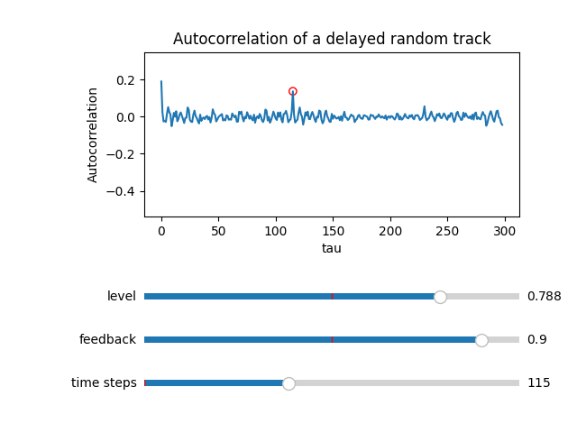

# Cathedral

## Introduction
This project started from the Eddie Van Halen song "Cathedral". It features a delayed guitar track and my objective is to retrieve the delay settings using scientific computing.

If you take a signal and apply a delay, the resulting signal will be correlated with the original one because there are repeating parts. If you compute the correlation between the delayed track and a translated version (operation known as autocorrelation) the result will hopefully peak when the time translation is equal to the delay.

My first implementation was numerically unstable, most probably because I was computing the autocorrelation of non-zero mean signals. This project is composed in two parts


## Part 1 - Interactivity
```(bash)
python demo_random.py
```

Develop a simple python application to interactively:
  * generate random signals and apply different delay settings
  * see in real-time the effect of such changes to the autocorrelation





## Part 2 - Full demo
```(bash)
python demo_wav.py <.wav audio file>
```

  * compute the auto correlation for the "Cathedral" track to solve the "inverse delay" problem
  * estimate with minimal effort the program time
  * explore different parallelization techniques (openmp, gpu offloading)


### Naive implementation
Computing autocorrelations by dot product of the signal with a shifted version of itself was the easiest solution. However, this approach is not scalable and it's inefficient from a memory access perspective.

Parallelizing this task exploited the fact that two consecutive cross-correlations essentially use the same data, so they can be grouped in a GPU warp to use SIMD operations. Despite using the full capabilities of the GPU, the execution time for a 4 minute song was around 100 seconds.

### FFT
The FFT can be used to compute efficiently the autocorrelation of a big signal as described in https://en.wikipedia.org/wiki/Autocorrelation#Efficient_computation
Using already implemented algorithms I was able to reduce the runtime under 4 seconds, thus eliminating the need for gpu offloading (where the data transfer latency could outweight the throughput benefits)
The two implementation gives similar results, so I favour the fastest one


## Comments on the effectiveness of the approach
The autocorrelation approach works really well when applied to "Cathedral" because the track is dominated by a relatively clean guitar sound. The plot shows a strong response at around 400 ms so I'm inclined to think that the original recording was made with such delay effect.


Other more interesting tracks such as "Run like hell" don't show any sign of delay. A possible explanation is that the delayed guitar is only a part of the song and it's mixed with drums, lyrics and other instruments. Possible solutions include:
  * find isolated guitar versions of the song
  * cut only relevant parts of the track (maybe mute the other parts) and repeat the experiment
